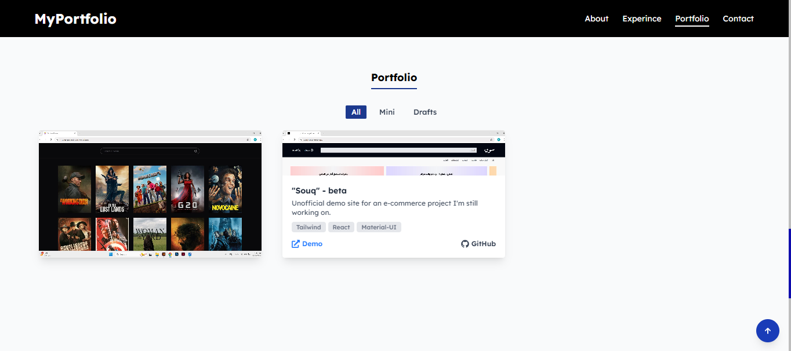
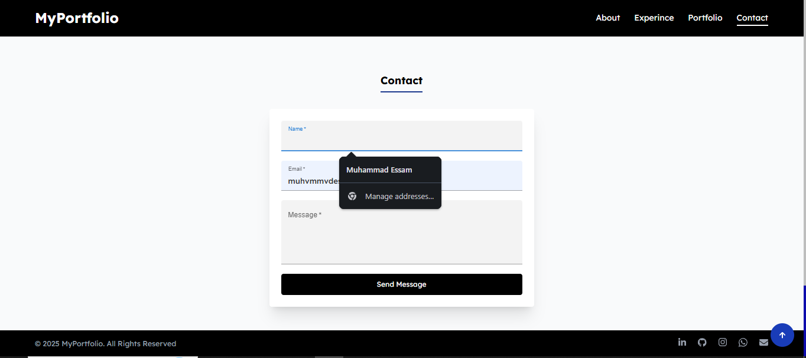
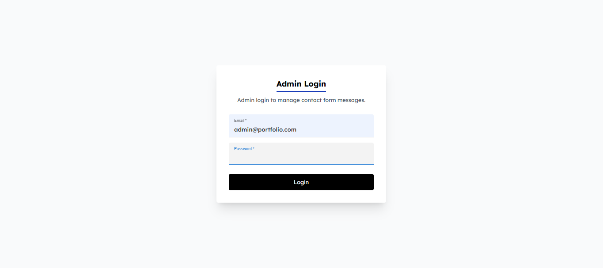
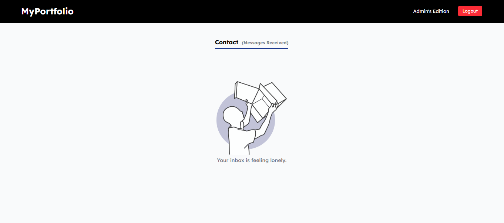
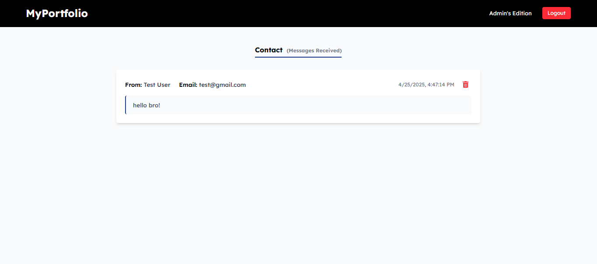

## MyPortfolio - (Pathline Academy Task)
#### *A responsive and dynamic portfolio website developed as part of **"Pathline Web Development Level III" Task**. The project showcases a variety of my work with filtering features, smooth animations, and backend integration.*
---
### 📌 Features
- Responsive layout built with **Tailwind CSS**
- Smooth animations and transitions using **GSAP**
- Project gallery with interactive filtering by category
- Accessibility features (ARIA roles, keyboard navigation)
- Contact form with backend functionality (Node.js)

---
### 📌 Tech-Stack
- **Frontend:** HTML, Tailwind CSS, JavaScript, GSAP
- **Backend:** Node.js, Express.js
- **Database:** MongoDB
- **Deployment:** Vercel, Heruko

---
### 📌 How To Run Localy
```
git clone https://github.com/lil-de7k/portfolio-client.git
cd portfolio-client
npm install
npm start
```
---
### 📌 Screenshots
#### 
#### 
#### 
#### 
#### 
#### 
---
### Live Demo
#### [MyPortfolio](https://muhammad-essam.vercel.app/)
---
### 📌 Contact
- Email: muhvmmvdessvm@example.com
- LinkedIn: https://linkedin.com/in/muhmedv
